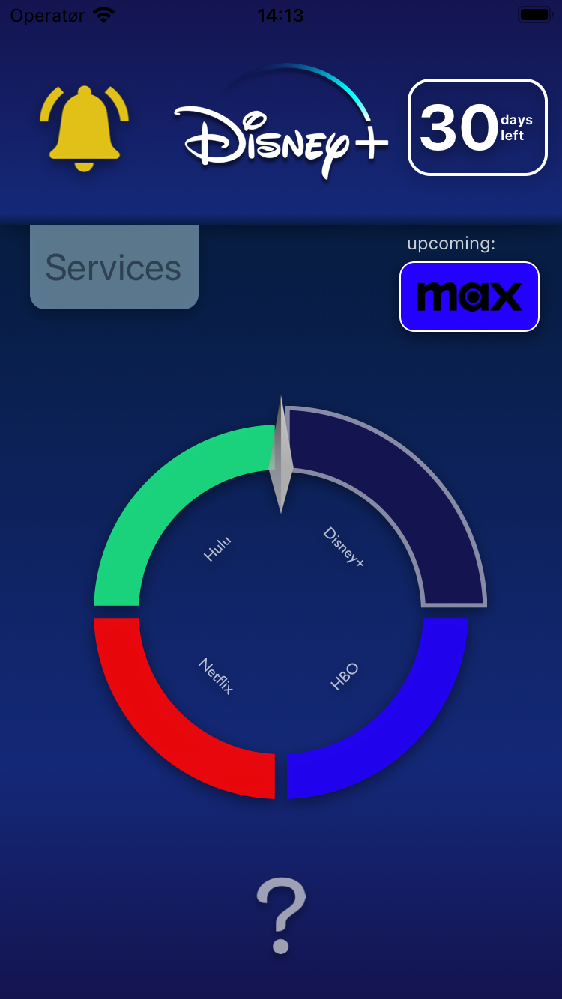
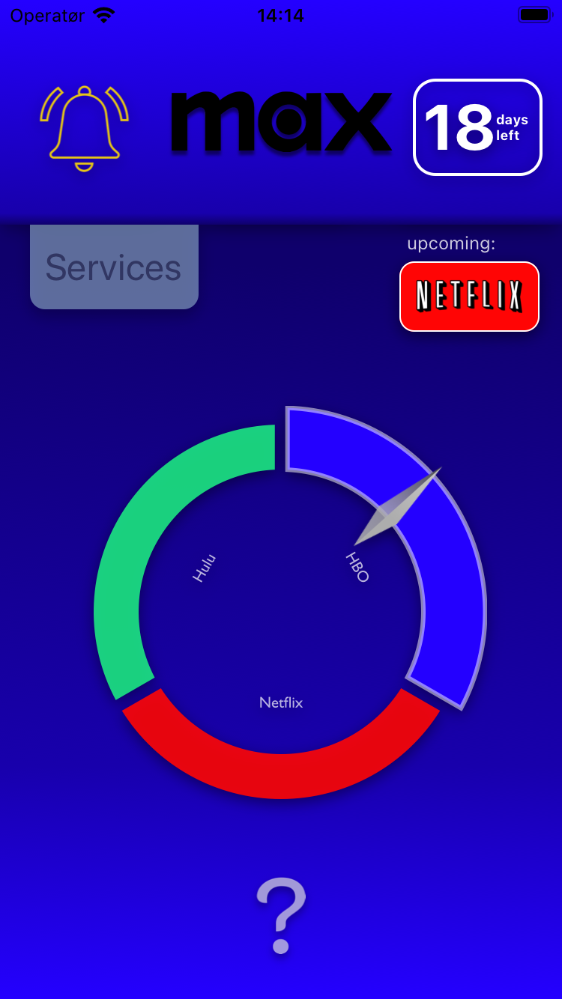
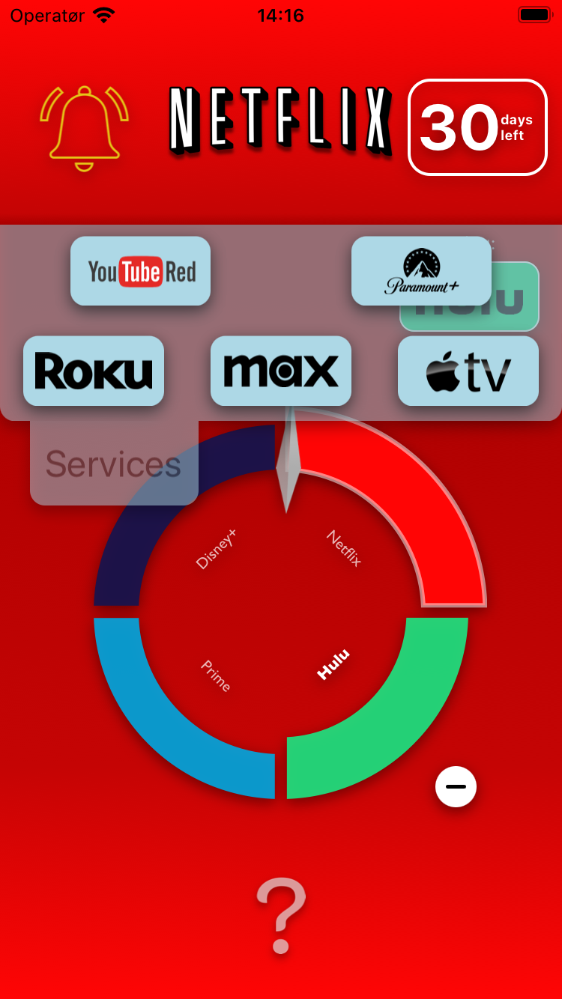
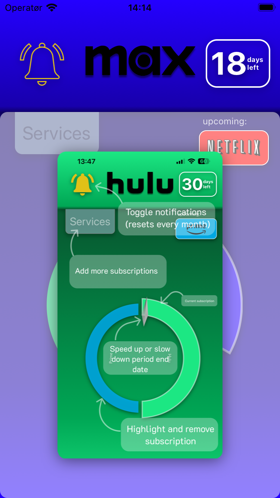

# Welcome to my 2024 summer project, subdub

Sometimes, just sometimes, your plans just doesnt pan out... No matter how planned out they might be you might have done a miscalculation, or after multiple unforseen events you find yourself in a place of failure. I promised myself long ago I would turn those situations into my own victories, and after failing to secure a summer internship I would do no different. Therefore a regular job was out of the question.

Wanting to do my own project I could have selected something more advanced that would have fit my skillset a bit better, like for example machine learning, however I wanted to make something that I could actually use, and do something I would not have the opportunity to do later. Therefore making my own app seemed like something to do, even if it is a bit 2010-ish.

## Goal

The best and simplest Idea I had was for an application that would help me save money on streaming services, as well as give me the opportunity to have multiple ones without actually paying for more than one. To do this you would set up a schedule of streaming services which would automatically rotate. By doing this you would have access to all your favorite series and upcoming new releases, at the cost of maby not having all of them at the same time.

## Tech

I wanted to create an app for bot ios and android, simply because I felt it was twice as useful. Multiple frameworks were possible, but because I had some experience with React, I felt React-Native would be the most efficient. In order to utilize the experience of an established framework I found Expo to be benificial, as there were good documentation, and resources that would deem invaluable later.

## Complications

Ideeally you would not have to do anything else than to see what subscription was active, and log in. However I quickly found out (to the best of my knowlege), that the large streaming services do not have API´s for creating and removing subscriptions. Therefore this would have to be something the user does manually.

Furthermore I also found out app development is no easy task, especially for multliple operating systems and device configurations. Small problems often took a long time to solve, and they usually lead to new problems which would have to be fixed. Combine this with summer vacation efficiency, and total lack of knowlege and experience, the development was slow and I could only focus on creating an MVP, but with as professional layout and styling as I could manage.

## Result

The result is a seemingly simple application with a barebones of functional components. However if I do say so myself none of those functions were simple, and I took the care of going the extra mile creating the most user friendly interfaces I could think of, even if they were far more complex. Some example of this is a dragbox containing multiple sub-dragboxes, or a circular-draggable component resembling a watch hand, that would calculate dates from angular radians, and vice-versa. There are also many animations and shadow styling functionalities, that was maticulus to get right.

Furthermore there are some more or less advanced backend logic for creating notifications and updating state twice a day using backend fetch. This seems simple enough, but remembering there are different api´s for the different operating systems, I was surprised how well it worked. Unfortunately these backend functions have not been tested well enough on real devices over time, and could prove to make the application useless when in production, but I am optimistic.

## Testing

I have tested the application on bot an ios simulator and android emulator, over multiple devices and operating systems, in conjunction with Expo go on my own ios device. Unfortunately I was not able to set up jest and babel correctly, and I have had some problems with this earlier too. When it works it works, but I did not want to spend valuable time doing that when I should rather spend it on the application itself. However rigorus testing is something I really wanted to utilize in this project, but maby next time.

## Production

The application is currently in production, however it might not make it all the way to the app stores. For Android they have implemented some new test requirements this year, forcing me to get an android device and get 20 testers etc, we will see how that goes but it might have to suffice with an internal test group.

For ios I was planning on getting the developer account to publish my application, however after seeing what was required for Android I did not want to spend that kind of money on something that might not pan out. Unfortunately there is no other alternatives for ios, so unless I get the developer account through some other means, it seems like my dream of using what I had built this summer stays exectly that, a dream.

# Summary

I am glad I took on this project, I have learned a lot, not only about app development but about creating production level code. Also I have managed to test my skillset and patience on tough development challenges, and proven to myself that I manage to do projects requiring such different kinds of skillsets, with nothing but myself pushing for a better product, and a better self. It is therefore extra sweet when I am genuinly proud of my product. It is near perfect, and far better than I would have ever dreamed I would be able to create when I set out.

https://github.com/user-attachments/assets/551e6c68-b2a0-4f56-82f6-72fa7790ee54

[Link to higher resolution video](./Demo-files/subdub_demo_high-res.MP4)
